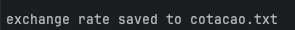
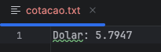
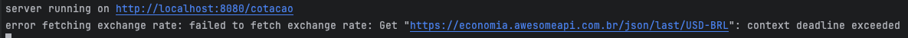
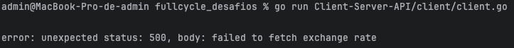

# Desafio FullCycle

Entregar dois sistemas em Go:
- client.go
- server.go

## Requisitos:
- o client.go deverá realizar uma requisição HTTP no server.go solicitando a cotação do dólar.
- o server.go deverá consumir a API contendo o câmbio de Dólar e Real no endereço: https://economia.awesomeapi.com.br/json/last/USD-BRL 
  - e em seguida deverá retornar no formato JSON o resultado para o cliente.

### Package "context":
- o server.go deverá registrar no banco de dados SQLite cada cotação recebida, 
  - sendo que o timeout máximo para chamar a API de cotação do dólar deverá ser de 200ms e o timeout máximo para conseguir persistir os dados no banco deverá ser de 10ms.
- o client.go precisará receber do server.go apenas o valor atual do câmbio (campo "bid" do JSON). 
  - Utilizando o package "context", o client.go terá um timeout máximo de 300ms para receber o resultado do server.go.
  
OBS: os 3 contextos deverão retornar erro nos logs caso o tempo de execução seja insuficiente.

1- [client] main()

2- [client] getExchangeRate()

3- [server] fetchExchangeRate()

### Salvar em arquivo:
- o client.go terá que salvar a cotação atual em um arquivo "cotacao.txt" no formato: Dólar: {valor}

### Endpoint:
- endpoint gerado pelo server.go: /cotacao
- porta utilizada pelo servidor HTTP: 8080.

## How To

```
 go run Client-Server-API/server/server.go
```

```
go run Client-Server-API/client/client.go
```

#### Expected:



- Open the cotacao.txt file to verify the content



### Errors expected timeout

1- [client] main()


2- [client]  getExchangeRate()
```
	client := &http.Client{}
	resp, err := client.Do(req)
	if err != nil {
		return "", fmt.Errorf("failed to fetch exchange rate: %w", err)
	}
	defer resp.Body.Close()
```
failed to fetch exchange rate: Get "http://localhost:8080/cotacao": context deadline exceeded

3- [server] fetchExchangeRate()
```
	moedas, err := fetchExchangeRate()
	if err != nil {
		http.Error(w, "failed to fetch exchange rate", http.StatusInternalServerError)
		fmt.Printf("error fetching exchange rate: %v\n", err)
		return
	}
```


error fetching exchange rate: failed to fetch exchange rate: Get "https://economia.awesomeapi.com.br/json/last/USD-BRL": context deadline exceeded

### Other errors
[client] getExchangeRate()
```
	if resp.StatusCode != http.StatusOK {
		body, _ := io.ReadAll(resp.Body)
		return "", fmt.Errorf("unexpected status: %d, body: %s", resp.StatusCode, string(body))
	}
```



### Tools
- https://transform.tools/json-to-go
