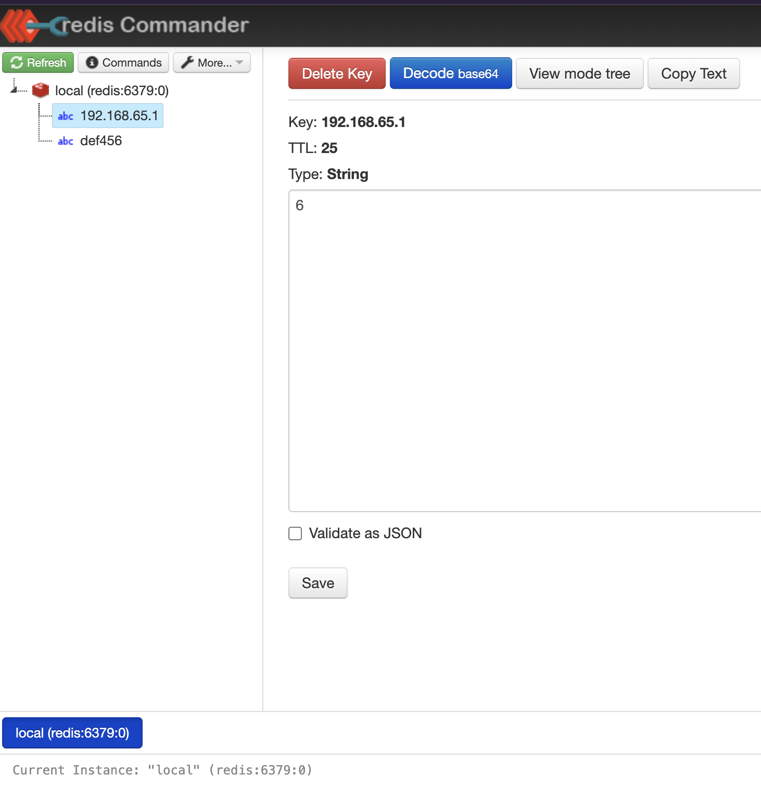

# Desafio FullCycle

### Objetivo
Desenvolver um rate limiter em Go que possa ser configurado para limitar o número máximo de requisições por segundo com base em um endereço IP específico ou em um token de acesso.

```
.
├── Dockerfile                      # Arquivo de configuração do Docker para construir o contêiner da aplicação
├── README.md                       # Documentação do projeto
├── assets                          # Diretório para armazenar ativos estáticos
│   └── images                      # Diretório para armazenar arquivos de imagem
│       └── redis_commander1.png    # Imagem de exemplo para o Redis Commander
├── cmd                             # Diretório para aplicativos de linha de comando
│   └── api                         # Diretório para a aplicação principal da API
│       ├── main.go                 # Ponto de entrada principal para a aplicação da API
│       └── main_test.go            # Testes para a aplicação da API
├── docker-compose.yaml             # Arquivo de configuração do Docker Compose para configurar o stack da aplicação
├── go.mod                          # Arquivo de módulo do Go para gerenciamento de dependências
├── go.sum                          # Arquivo de checksum do Go para dependências
└── internal                        # Diretório para o código interno da aplicação
    └── infra                       # Diretório para o código relacionado à infraestrutura
        ├── config                  # Diretório para o código relacionado à configuração
        │   └── config.go           # Carregamento e gerenciamento de configuração
        ├── limiter                 # Diretório para a lógica de rate limit
        │   ├── in_memory.go        # Estratégia de armazenamento em memória para rate limit
        │   ├── in_memory_test.go   # Testes para a estratégia de armazenamento em memória
        │   ├── limiter.go          # Lógica principal de rate limit
        │   ├── limiter_test.go     # Testes para a lógica de rate limit
        │   ├── mock                # Diretório para implementações mock
        │   │   ├── mock_redis_client.go    # Implementação mock para o cliente Redis
        │   │   └── mock_storage_strategy.go # Implementação mock para a estratégia de armazenamento
        │   ├── redis.go            # Estratégia de armazenamento Redis para rate limit
        │   ├── redis_client.go     # Interface do cliente Redis
        │   ├── redis_test.go       # Testes para a estratégia de armazenamento Redis
        │   └── storage_strategy.go # Interface para estratégias de armazenamento
        └── middleware              # Diretório para componentes de middleware
            ├── middleware.go       # Middleware para rate limit
            └── middleware_test.go  # Testes para componentes de middleware
```


## Executando a Aplicação

1. Clone o repositório.
2. Navegue até o diretório `Rate-Limit`
3. Execute ` docker-compose up --build` para iniciar os contêineres

## Testando

1. Limitação por IP:
```bash
for i in {1..6}; do curl -X GET http://localhost:8080/; done
```
A sexta requisição deve retornar 429 Too Many Requests. Aguarde 60 segundos para poder fazer outra requisição.

2. Limitação por Token:

- Token 1 (10 requisições por 60 segundos):
```bash
for i in {1..11}; do curl -X GET -H "API_KEY: abc123" http://localhost:8080/; done
```
A décima primeira requisição deve retornar 429 Too Many Requests. Aguarde 60 segundos para poder fazer outra requisição.

- Token 2 (20 requisições por 65 segundos):
```bash
for i in {1..21}; do curl -X GET -H "API_KEY: def456" http://localhost:8080/; done
```
A vigésima primeira requisição deve retornar 429 Too Many Requests. Aguarde 65 segundos para poder fazer outra requisição.

## Redis commander
1. Navegue até `http://127.0.0.1:8081/` 
2. A cada requisição é possível visualizar as configuraçÕes do redis: IP, Token, e TTl de cada chamada.


### Testes Automatizados:
localizados em `internal/usecase/test/rate_limiter_test.go`, `internal/repository/storage/redis_test.go` e `internal/middleware/middleware_test.go`