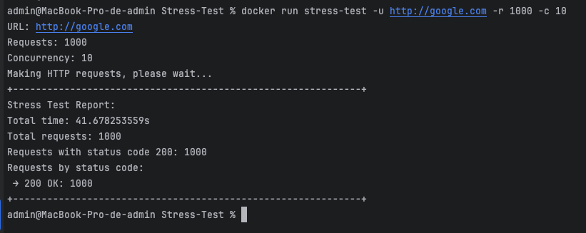

# Desafios FullCycle


## Stress Test

1. acesse o diretorio do projeto - Stress-Test
```shell
cd Stress-Test
```
2. Execute o comando abaixo para construir a imagem docker
```shell
docker build -t stress-test .
```
3. Execute o comando abaixo para executar o teste de stress com docker
```shell
docker run stress-test -u http://google.com -r 1000 -c 10
```

Exemplo execução com relatório gerado

